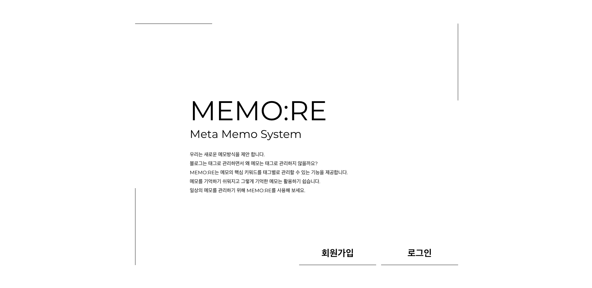

# 프로젝트 소개

기억하고 싶은 것들이 있다면<br>
메모 기록 서비스
<br><br>



<aside>
👾 10일 동안 진행한 짧은 미니 프로젝트입니다. 태그를 기준으로 메모를 작성하고 분류해서 필요한 아이디어를 얻을 수 있습니다.

</aside>

<h2>작업자</h2>
기획자 권순우<br>
디자이너 박송이<br>
FE 이송은<br>
BE 강휴일<br>

<h2>작업 기간</h2>
2023.08.04 ~ 2023.08.13

## 🕹️ 기술 스택

- Java , Spring Boot, Spring Security(JWT)
- MySQL , JPA
- RestApi

## 🤗 역할

- **BackEnd 기능 개발**
- 아이디어 제안과 기능 회의 및 개발
  - 원활한 서비스를 위해 태그 수정 제한을 제안
  - JWT 인증 로그인 및 회원가입, 메모 CRUD 와 List 등 각종 기능 개발
  - RestApi 로 Front 서버와 통신

<h2>주소</h2>
*프로젝트 일기(https://hyuil.tistory.com/category/%ED%94%84%EB%A1%9C%EC%A0%9D%ED%8A%B8/%ED%8C%80%20%ED%94%84%EB%A1%9C%EC%A0%9D%ED%8A%B8%29%20MEMO%3ARE)<br><br>
<br>


<h2>주요 기능</h2>

<h3>로그인 회원가입</h3>

```swift
회원가입
- 아이디 중복 확인 후 가입

로그인
- SpringSecurity Filter 를 이용해 JWT 로그인 인증
- Front Server 와 Header 에 JWT 를 주고 받으며 인증
- Cookie 에 Access Token 넣어 주고 받기
```


<h3>게시판</h3>


```swift
메모
- 태그를 기준으로 정렬 가능
- 다중 태그 허용
- 중복 메모 불허용
```

<h3>기타</h3>


```swift
- 여러 컨트롤러에서 반복되는 중복 코드 줄이기 위해 WebService 구현
 * Header 에서 id 를 가져오는 코드
 * ResponseEntity 를 보내는 코드
 * json 을 파싱하거나 만드는 코드

- 예외 컨트롤을 편하게 하기 위해 사용자 정의 예외 구현
 * UserNotFoundException - 회원을 찾지 못했을 때
 * DuplicateMemoException - 중복 메모일 때
 
- AWS RDS 이용

- Test
- @SpringBootTest 를 이용한 서비스 테스트
- @AutoConfigureMockMvc 를 이용한 Controller 테스트
```
<br>
<br>

## 프로젝트를 진행하며…

### 🙌 **개인적인 목표**

- **여러 분야의 분들과 원활하게 소통하며 협업하고 싶다.**
- **테스트 코드를 작성해보고 싶다.**
  - [테스트 코드 작성으로 개발 시간 단축.](https://github.com/h0l1da2/MEMO-RE_BE/tree/master/src/test/java/sori/jakku/kkunkkyu/memore)
- **RestApi 를 사용해보고 싶다.**
  - [프론트와 통신하고 데이터 주고 받기 성공](https://hyuil.tistory.com/240)
- **트랜잭션을 남용하지 않고 올바르게 사용하고 싶다.**
  - [필요한 최소한의 구간과 순간에만 @Transactional 애노테이션 부가](https://github.com/h0l1da2/MEMO-RE_BE/blob/master/src/main/java/sori/jakku/kkunkkyu/memore/repository/CustomTagMemoRepository.java)
- **프로젝트를 완성!!하고 싶다.**
  - [애자일로 스프린트를 나눠 핵심 기능 위주로 개발하도록 하여 결과적으로 10일 안에 결과물이 나올 수 있었음. 😇](https://hyuil.tistory.com/243)

### 😵 힘들었던 점

- **다른 직무 분들과 소통하는 어려움.**
  - 그 분들은 개발을 모르시니 요청하신 기능이나 서비스가 왜 구현하기 어렵거나 시간이 필요한지 알기 쉽게 설명해야했다.
  - 개발 외적인 소통도 필요하구나 하는 생각과 고민이 들었다.
  - [원활한 소통으로 직무별 최고 동료상을 받을 수 있었다. 😭](https://img1.daumcdn.net/thumb/R1280x0/?scode=mtistory2&fname=https%3A%2F%2Fblog.kakaocdn.net%2Fdn%2Fbk0CMK%2FbtsrctuDkPY%2FZaM73jHrLXyIZJuoc6Tve0%2Fimg.png)
- **Cors 정책으로 프론트 통신에 어려움이 있었다.**
  - [그 동안 공부했던 Network 지식과 Security 지식을 이용해 Cors 관련 설정 완료.](https://hyuil.tistory.com/240)
- **트랜잭션은 어떻게 해야 올바르게 사용하는 것일까 의문.**
  - [Database 서적 학습을 통해 트랜잭션의 올바른 사용법에 대해 공부.](https://hyuil.tistory.com/236)
- **10일 간의 개발 기간이 너무도 짧다. 내가 개발을 얼마나 빨리 할 수 있는지 일정 관리가 안 된다.**
  - 애자일 방식을 이용해 스프린트를 나눠 개발하여 두루뭉술한 일정에 따라가는 것이 아니라 역량에 따라 개발할 수 있었다.

[👍 그 동안 함께해왔던 기록 notion 확인하기 클릭!](https://song-eun.notion.site/MEMO-RE-4b0c4a898ac146f099c3fdc43a278860?pvs=4)<br>
[✉️ 개발 일기 훑어보기 클릭!](https://hyuil.tistory.com/category/%ED%94%84%EB%A1%9C%EC%A0%9D%ED%8A%B8/%ED%8C%80%20%ED%94%84%EB%A1%9C%EC%A0%9D%ED%8A%B8%29%20MEMO%3ARE)